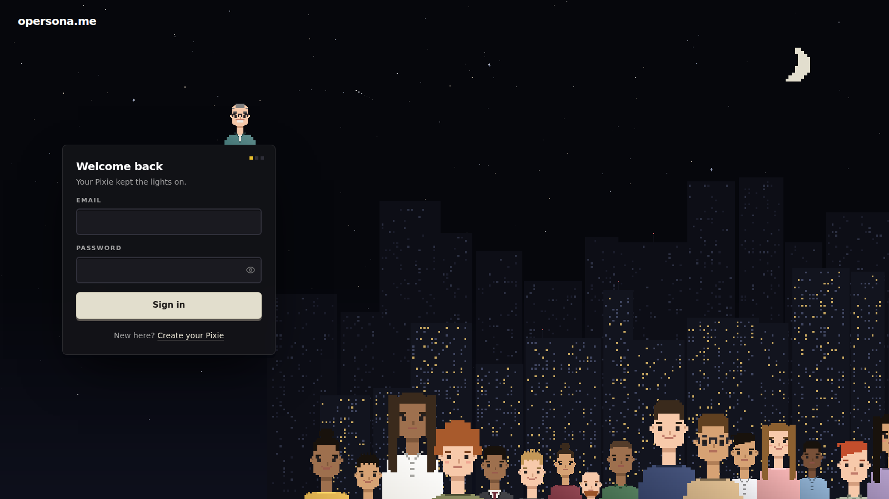
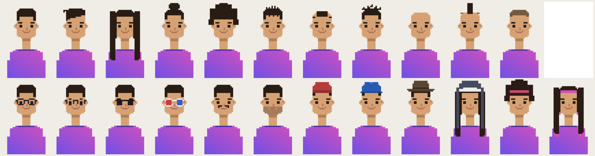
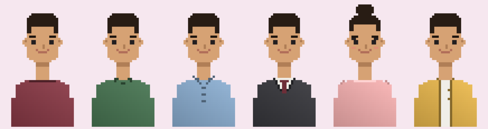
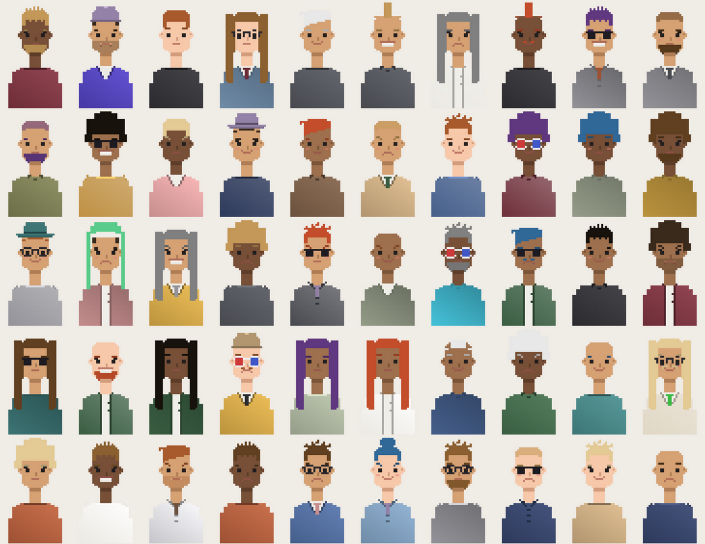
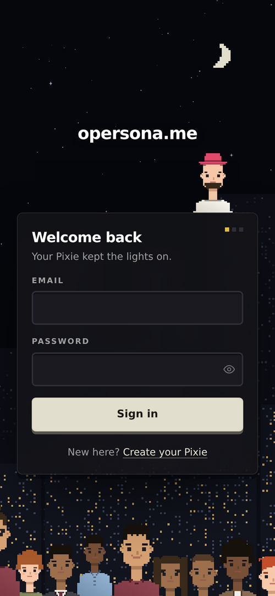

# opersona

**How you think, not what you know.**

opersona is a self-hosted webapp where every person on a team gets a **Pixie** — a persistent
Claude persona that learns their *reasoning fingerprint* from the way they actually work: how they
break problems down, what they check first, when they push back. Not a chat-history parrot — a
model of *how* someone thinks, built from evidence, gated by their own confirmation.

Colleagues can ask your Pixie things when you're away. You can test it ("does this sound like
me?") and correct it. And it all runs on **your own machine**, on **your own Claude
subscription**, through the [Claude Agent SDK](https://code.claude.com/docs/en/agent-sdk) —
nothing sits between your box and Anthropic: no vendor server, no telemetry, no third-party
middleman ever sees a message.



## What it does

- **Learns how you think.** Every conversation is mined (on your machine, by your Claude) for
  domain-free reasoning patterns — *"wants raw command output before hypothesizing"*, *"invites
  criticism of their own proposals"* — each backed by verbatim quotes from your own messages.
  Patterns only enter your persona once confirmed by repetition or by you. Silence beats a wrong
  stereotype.
- **Remembers what happened.** An episodic memory distills each finished conversation
  ("what was the problem, what did we decide") that your persona can recall later — and that you
  can export as a Markdown vault (Obsidian-compatible). Owner-private, always.
- **Imports your history.** claude.ai export zips, Claude Code sessions (hook or upload),
  and ChatGPT / Codex exports all feed the same extractor.
- **A real chat, not a toy.** Web search, per-conversation model/effort settings, attachments
  (images, PDFs, code, zips), and **sandboxed code execution**: your chat can run Python/Node,
  process the files you upload, and hand results back as downloads — inside a kernel-level jail
  with no network and no host filesystem access.
- **Pixies.** Every person gets a procedurally drawn pixel avatar — from a selfie (never stored)
  or a dice roll — that blinks, thinks, and talks in the UI.
- **Private by construction.** Invite-only, mandatory TOTP two-factor auth, and an
  enforcement-over-surveillance privacy model: the product has no page, stream, or API that shows
  an admin anyone else's content. There's a Privacy page in-app that says exactly what's visible
  to whom.

## Pixies

Flat, cute, procedural pixel people — 11 hairstyles, 6 garments, glasses, hats, facial hair,
freckles, dip-dye tips, all from one typed recipe.

## Command Center

Appoint a boss (`/office`): star a persona and it runs the floor — it delegates work to
whoever fits best, hires **temporary specialist personas** from a job description you watch it
write (role, strengths, responsibilities, how to think), and archives them between engagements.
Personas can also consult each other directly: ask yours to check something with a colleague
and it puts the question to their persona — shareable knowledge only, one hop max, and every
consultation is on the record for the people involved. The Tasks tab shows your delegations
with live status; Team and Activity show the org-visible staffing picture.





## Architecture

```
apps/web         Next.js 15 — auth (better-auth, invite-only + TOTP), chat UI, persona pages,
                 approvals, settings; talks to the engine only through an authenticated proxy
apps/engine      Hono + Claude Agent SDK — one live query() per conversation (streaming input,
                 idle-reap + resume), persona MCP tools, learning jobs, sandboxed exec, SSE
packages/db      Drizzle + Postgres 16 — persona layers with a provenance spine (every learned
                 row carries evidence, confidence, and status), conversations, episodes, costs
packages/shared  zod schemas (AvatarRecipe, engine events), redactSecrets, crypto helpers
packages/pixel-avatar  the Pixie engine — recipe → 36×56 portrait, animation frames, PNG/canvas
sbx/             bubblewrap sandbox runner for chat code execution
```

Key design choices, documented in [`docs/`](docs/):

| Doc | What's inside |
| --- | --- |
| [architecture.md](docs/architecture.md) | The two-service layout, session lifecycle, prompt assembly, cost logging |
| [learning.md](docs/learning.md) | Reasoning fingerprint, episodes, imports, self-tests, pattern hygiene |
| [chat-and-sandbox.md](docs/chat-and-sandbox.md) | Chat features, attachments, the code-execution jail, file downloads |
| [pixies.md](docs/pixies.md) | The avatar engine: recipes, the v2 art style, animation, regression contract |
| [security-and-privacy.md](docs/security-and-privacy.md) | Threat model, auth, sandbox guarantees, the privacy model |
| [self-hosting.md](docs/self-hosting.md) | What it takes to run this on your own box (honest edition) |
| [devlog.md](docs/devlog.md) | Milestones — what was built, in what order, and why |
| [ENGINE_API.md](docs/ENGINE_API.md) | The web ↔ engine HTTP contract |

## Running it

opersona is **self-hosted by design** — you bring a machine, and every workspace brings
its own Claude: either the **opersona bridge** (a tiny daemon on your computer that runs
chats on the Claude subscription you already have) or an Anthropic API key. There is no
shared platform account. The short version:

```bash
# Node 22, pnpm 9, Postgres 16 required; bubblewrap for chat code execution
cp .env.example .env      # set DATABASE_URL, ENGINE_INTERNAL_TOKEN, BETTER_AUTH_*, SECRETS_KEK;
                          # see docs/self-hosting.md for first-run
pnpm install
pnpm -C packages/db migrate
pnpm dev                  # web :3000, engine :4000
```

The full walk-through — including reverse proxy, systemd units, the sandbox's host
prerequisites, and what is *not* yet automated — is in
[docs/self-hosting.md](docs/self-hosting.md). A one-command installer is on the roadmap.

## Roadmap

- **Deployability** — docker-compose + first-run bootstrap, so "clone, compose up, sign in" is
  the whole install.
- Email invites, org knowledge base, persona-to-persona messaging.

## Mobile

Works properly on phones — dedicated layouts, not shrunken desktop.


